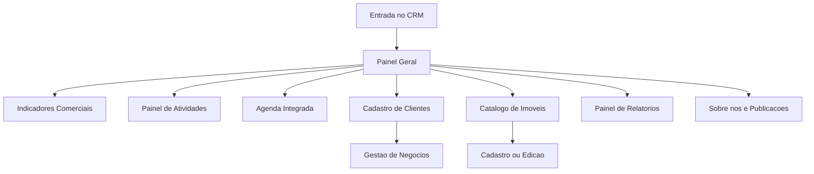

```json okf-profile
{
  "id": "fluxos-crm-mobile",
  "title": "Fluxos do CRM Mobile Mezanino",
  "category": "crm",
  "summary": "Mapeamento dos fluxos de execucao, navegacao e comportamento operacional do app Mezanino CRM Mobile.",
  "tags": ["crm", "mobile", "fluxos", "auditoria", "operacao"],
  "body": "O Mezanino CRM Mobile (empacotado via Capacitor) fornece acessibilidade total as ferramentas comerciais para a equipe de corretores em campo. Mapeia fluxos de login delegado, navegacao inteligente recolhivel (otimizada para smartphones como o Moto G24), painel de atividades enriquecido com vinculos contextuais e acoes de manutencao de cadastros e relatorios de mercado."
}
```

# Fluxos do CRM Mobile Mezanino

O aplicativo móvel, empacotado via **Capacitor**, é o canal de operação interna utilizado pela equipe comercial do Mezanino em campo. Ele foi projetado para unificar as atividades de vendas e captação física de imóveis à atualização de conteúdo pública, tudo diretamente pelo dispositivo móvel.

---

## 1. Mapa de Fluxos de Trabalho em Dispositivo

A interação de entrada e o desdobramento das ações dentro do aplicativo móvel seguem o diagrama de navegação operacional:



---

## 2. Padrões de Navegação e Usabilidade (Moto G24 Power)

O aplicativo foi auditado no smartphone **Moto G24 Power (Android 14, resolução de 720 × 1612)**, estabelecendo padrões para o layout de tela mobile do CRM:

* **Navegação Lateral Recolhível (Drawer)**:
  * O menu de navegação ocupa uma gaveta móvel de `280px` de largura máxima (sem preencher a tela inteira), permitindo vislumbrar o contexto de fundo.
  * O menu lateral pode ser aberto ou retraído por arrasto horizontal táctil iniciado a partir da borda esquerda do aparelho, respeitando um limite de segurança de `50%` para determinar se a barra deve ser travada ou recolhida.
  * Evita conflito com o gesto nativo "Voltar" do Android restringindo a expansão somente ao botão-ícone em estados específicos.
* **Estado Recolhido da Navegação**:
  * Ao ser ocultado, o menu colapsa em uma coluna limpa de `36px` lógicos que não consome espaço de trabalho útil do corretor.
  * O ícone da logo e textos secundários desaparecem nesse estado, sobrando apenas as áreas de toque essenciais. Em modo paisagem, a barra é totalmente oculta.
* **Alvos de Toque**:
  * Botões interativos centrais medem no mínimo `47px × 67px` de área sensível ao toque para evitar erros de operação em telas compactas.
  * O botão de fechamento da gaveta (drawer) é mantido afastado das barras de rolagem nativas para evitar concorrência ou bloqueio de interações.

---

## 3. Comportamento e Regras de Negócio dos Fluxos

### A. Fluxo de Atividades
* **Registro Tático**: O registro de atividades comerciais não é mais uma geração de logs automáticos frios. O corretor preenche ativamente um formulário especificando:
  * Tipo de contato (mensagem, ligação, visita presencial, simulação).
  * Vendedor responsável.
  * Resultado imediato e Próximo Passo.
  * Vínculo contextualizado com o imóvel, o cliente e o negócio relacionado.
* **Visualização Compacta**: Apresentado em formato de blocos sequenciais onde o resumo da atividade, a data e os respectivos vínculos são empilhados logicamente, evitando sobreposição e facilitando a leitura rápida no trânsito urbano.

### B. Manutenção e Edição de Imóveis em Campo
* **Formulário Nativo do CRM**: O corretor pode editar informações de imóveis diretamente de dentro do aplicativo comercial. O sistema não redireciona o usuário para páginas públicas externas do portal; o formulário permanece integrado para garantir foco operacional.
* **Ocultação de Termos Técnicos**: Rótulos e conceitos estritamente voltados a desenvolvedores (como "Grid", "CMS", "GitHub", "Token" ou "API") são ocultados do usuário final do aplicativo, traduzindo-se em ações de negócios claras ("Salvar Alterações", "Visualizar Destaques", "Atualizar Informações").

### C. Publicação e Retornos de Operação
* **Feedback Através de Banner**: Todas as ações destrutivas ou críticas (como Exclusão, Atualização de Catálogo, Envio de Leads ou Salvamentos de Conteúdo) mostram banners flutuantes de feedback no topo do aplicativo, detalhando se a operação foi gravada localmente ou transmitida com sucesso para o servidor do CRM.
