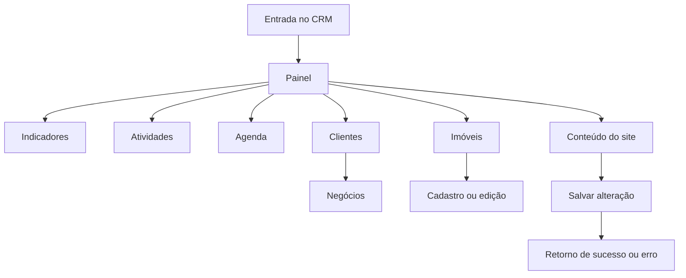

# Auditoria do CRM Mobile Mezanino — em andamento

## Escopo confirmado

O aplicativo Capacitor é o CRM mobile interno do Mezanino. A edição de conteúdo do site integra o CRM: a equipe comercial e de conteúdo pode atualizar a presença pública sem sair do aplicativo.

## Evidências no dispositivo

- Dispositivo: Moto G24 Power, Android 14, 720 × 1612.
- Build de auditoria: `com.mezanino.imobiliaria.audit`.
- Entrada: dashboard CRM, sem vitrine pública.
- Navegação lateral: recolhível pelo controle integrado ao bloco da logo.

## Fluxos em revisão

| Fluxo | Estado atual | Evidência / decisão |
| --- | --- | --- |
| Abertura do aplicativo | Corrigido | O app de auditoria abre no dashboard, sem exigir o fluxo de login local. O login protegido permanece para produção. |
| Carregamento do painel | Corrigido | Corrigido erro quando não há corretores no snapshot; usa identificação neutra da Equipe Mezanino. |
| Navegação principal | Validado após reinício | O arrasto horizontal na navegação aberta retrai; o ícone expande. No Moto, o ícone mede 47 × 67 px, fica sem coluna reservada e expõe “Expandir navegação” ao leitor de tela. |
| Painel | Validado | Estado recolhido inspecionado por captura visual: sem faixa lateral reservada; indicadores e atalhos mantêm leitura e áreas de toque. |
| Indicadores | Validado | Lista de indicadores, leitura operacional e ação Atualizar aparecem no Moto; descrição simplificada para linguagem de CRM. |
| Atividades | Corrigido e validado | Corrigida sobreposição do acordeão. Título, data, descrição e imóvel relacionado agora formam uma sequência legível no Moto. |
| CRM de clientes | A testar | Cadastro, atualização, anexos, vínculo a negócio e feedback de gravação. |
| Negócios | A testar | Pipeline, etapa, saúde, riscos, lacunas, próximo compromisso e vínculo com imóvel/cliente. |
| Agenda | A testar | Novo agendamento, confirmação, mudança de status e acesso ao registro relacionado. |
| Imóveis | Edição validada | No Moto, **Editar** abre o formulário preenchido dentro do CRM; cadastro, exclusão e retorno de publicação seguem em validação. |
| Mercado | A testar | Leitura, fonte, limitação, confiança e atualização. |
| Relatórios | A testar | Geração, download e feedback do PDF. |
| Conteúdo do site | A testar | Edição de páginas e blocos de conteúdo, salvamento, retorno de publicação e rastreabilidade. |

## Mapa dos fluxos em avaliação

## Ajustes de escopo já aplicados

- **Sobre nós** e **Edições** permanecem na navegação mobile: são fluxos de conteúdo e publicação pertencentes ao CRM Mezanino.
- Preservados os tokens, tipografia, paleta, superfícies e linguagem visual já estabelecidos no código.

## Falha corrigida

O formulário de login tratava cada evento de digitação como tentativa de login, reconstruindo a tela e apagando a senha. A delegação de eventos foi corrigida para disparar ações de entrada apenas no próprio campo, não no formulário-pai.

## Correções em validação

- O modo de auditoria agora grava alterações somente no armazenamento do aparelho. Assim, os testes de cadastro, edição e exclusão não publicam dados de teste no site.
- Clientes, agendamentos e os registros das áreas de CRM passam a ter ação explícita de **Editar**. Antes, parte dessas áreas permitia apenas criar ou excluir, quebrando o fluxo básico de manutenção.
- A navegação recolhida vira somente o botão-ícone: coluna de 36 px lógicos, sem superfície, borda ou texto. A marca textual desaparece nesse estado para liberar o espaço de trabalho.
- Refinamento de orientação: a regra de estado recolhido agora oculta todo o menu também em paisagem; antes, somente no modo retrato os ícones deixavam de aparecer.
- Revisão visual no Moto identificou uma faixa escura residual à esquerda mesmo com o menu oculto. A navegação recolhida passa a ser um único botão flutuante e deixa de reservar coluna. Também foi registrada sobreposição no card de atividade como falha visual a corrigir na próxima etapa.
- Interação em implantação: drawer móvel de 280 px, sem ocupar a largura toda. Um arrasto iniciado em faixa segura à esquerda acompanha o dedo e usa limite de 50% para decidir entre abrir e recolher; o botão continua sendo a alternativa explícita.
- Imagem quebrada corrigida: a marca do drawer apontava para `wordmark.svg`, que não existe no pacote. O CRM passa a usar `wordmark.png`, já incluído no build. O fundo claro inesperado do drawer também foi rastreado a uma regra CSS posterior e recebeu sobrescrita mobile escura.
- A tela de **Atividades** foi revisada visualmente no Moto: o acordeão estava herdando uma grade incompatível e sobrepondo título, data e vínculos. A estrutura foi corrigida para bloco único, com conteúdo relacionado abaixo do resumo.
- Fluxo CRM de **Atividades** ampliado: registrar atividade abre formulário em vez de criar dado automático; o registro passa a comportar tipo, responsável, resultado, próximo passo e vínculos com imóvel, cliente e vendedor. Cada item ganha editar e excluir com o feedback padrão do CRM.
- Correção de interação do drawer em andamento: o controle de recolher estava junto ao trilho de rolagem móvel. O botão foi afastado para preservar seu alvo de toque e não bloquear a interação com o conteúdo.
- A edição de imóveis no aplicativo passa a usar o formulário do CRM, sem desviar para uma tela pública. Rótulos técnicos como **Grid**, **Hero**, **CMS**, **GitHub** e **produto** estão sendo removidos dos caminhos de uso final; os mecanismos internos permanecem apenas no código.
- O retorno de ações agora aparece no banner de status do CRM, incluindo criação, atualização, exclusão e salvamento local de auditoria. A identificação do cabeçalho foi simplificada para **Mezanino CRM** e **Operação comercial**.
- O salvamento de **Conteúdo do site** e **Sobre nós** agora apresenta o retorno real da operação. No APK de auditoria, a mensagem informa que a alteração ficou somente neste aparelho — sem simular publicação externa.
- A navegação recolhida não fica mais sobre a área de trabalho: o painel recebe prioridade de empilhamento e largura mínima segura. Arrastar a navegação aberta para a esquerda a recolhe; a expansão permanece no botão-ícone, evitando conflito com o gesto nativo de voltar do Android na borda esquerda.

## Próximas evidências

1. Capturar cada aba e seu estado vazio, preenchido, erro e sucesso.
2. Executar ações destrutivas somente contra registros de auditoria criados para o teste.
3. Consolidar a matriz de fluxos, feedbacks e pendências no relatório HTML para stakeholders.
